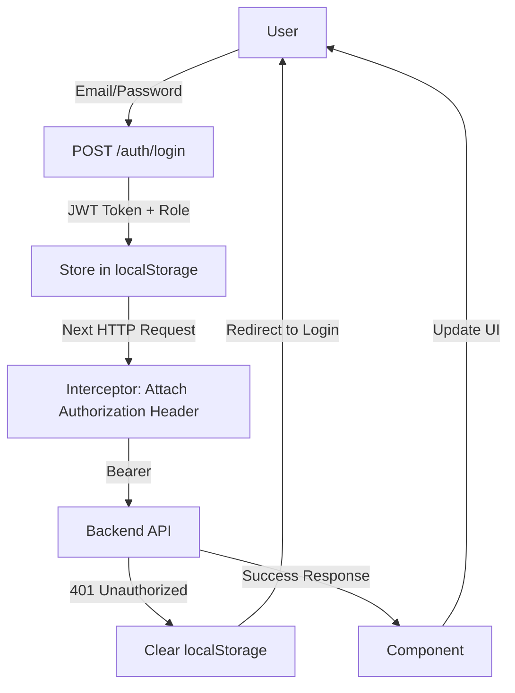

# Angular Frontend Architecture Guide - Leave Management System

## 📋 Table of Contents

1. [Project Structure](#project-structure)
2. [Authentication & Authorization](#authentication--authorization)
3. [Services & API Integration](#services--api-integration)
4. [Component Best Practices](#component-best-practices)
5. [Examples](#examples)
6. [Environment Configuration](#environment-configuration)
7. [Error Handling](#error-handling)

---

## Project Structure

```
src/
├── app/
│   ├── core/                    # Core module - singleton services
│   │   ├── guards/
│   │   │   └── auth.guard.ts    # Authentication & Role-based guards
│   │   ├── interceptors/
│   │   │   └── auth.interceptor.ts  # JWT token attachment & error handling
│   │   ├── models/
│   │   │   └── hr.model.ts      # All TypeScript interfaces & types
│   │   └── services/
│   │       ├── auth.service.ts          # Authentication logic
│   │       ├── user.service.ts          # User management API
│   │       ├── leave.service.ts         # Leave management API
│   │       ├── performance.service.ts   # Performance review API
│   │       ├── master-data.service.ts   # Departments, designations, holidays
│   │       └── toast.service.ts         # Notifications
│   │
│   ├── layout/                  # Shared layout components
│   │   ├── main-layout/
│   │   ├── navbar/
│   │   └── sidebar/
│   │
│   ├── pages/                   # Feature-based pages
│   │   ├── login/
│   │   ├── admin/
│   │   │   ├── dashboard/
│   │   │   ├── users/
│   │   │   ├── leaves/
│   │   │   └── settings/
│   │   ├── manager/
│   │   │   ├── dashboard/
│   │   │   └── leave-requests/
│   │   └── employee/
│   │       ├── dashboard/
│   │       ├── apply-leave/
│   │       └── my-leaves/
│   │
│   ├── shared/                  # Shared utilities
│   │   ├── components/
│   │   └── pipes/
│   │
│   ├── app.config.ts            # App configuration (providers)
│   └── app.routes.ts            # Route definitions
│
├── environments/
│   ├── environment.ts           # Production environment
│   └── environment.development.ts  # Development environment
│
├── main.ts
└── index.html
```

---

## Authentication & Authorization

### 1. JWT Authentication Flow

```
┌─────────────┐
│   User      │
└──────┬──────┘
       │ Login with email/password
       ▼
┌─────────────────────────────┐
│  POST /auth/login           │
└──────┬──────────────────────┘
       │ Returns token + role
       ▼
┌─────────────────────────────┐
│ Store in localStorage       │
│ - hr_token                  │
│ - hr_user (name, role)      │
└──────┬──────────────────────┘
       │
       ▼
┌─────────────────────────────┐
│ Every subsequent request    │
│ Attach: Authorization:     │
│ Bearer <token>              │
└─────────────────────────────┘
```

### 2. LoginComponent Example

```typescript
import { Component, inject } from '@angular/core';
import { FormBuilder, Validators } from '@angular/forms';
import { AuthService } from '../../core/services/auth.service';
import { ToastService } from '../../core/services/toast.service';

@Component({
  selector: 'app-login',
  template: `
    <form [formGroup]="loginForm" (ngSubmit)="onLogin()">
      <input formControlName="email" placeholder="Email" type="email">
      <input formControlName="password" placeholder="Password" type="password">
      <button [disabled]="loginForm.invalid || loading">
        {{ loading ? 'Logging in...' : 'Login' }}
      </button>
      <div *ngIf="errorMessage" class="error">{{ errorMessage }}</div>
    </form>
  `
})
export class LoginComponent {
  private authService = inject(AuthService);
  private toastService = inject(ToastService);
  private fb = inject(FormBuilder);

  loginForm = this.fb.group({
    email: ['', [Validators.required, Validators.email]],
    password: ['', [Validators.required, Validators.minLength(6)]]
  });

  loading = false;
  errorMessage = '';

  onLogin(): void {
    if (this.loginForm.invalid) return;

    this.loading = true;
    const { email, password } = this.loginForm.value;

    this.authService.login(email, password).subscribe({
      next: (user) => {
        this.toastService.success('Login Successful', `Welcome ${user.name}!`);
        // Navigation is handled by AuthService
      },
      error: (err) => {
        this.loading = false;
        this.errorMessage = err.message;
        this.toastService.error('Login Failed', err.message);
      }
    });
  }
}
```

### 3. Guards - Auth & Role Protection

```typescript
// app.routes.ts
export const routes: Routes = [
  {
    path: 'employee',
    component: MainLayoutComponent,
    canActivate: [authGuard, roleGuard],  // Must be authenticated AND have EMPLOYEE role
    data: { role: 'EMPLOYEE' },
    children: [/* ... */]
  },
  {
    path: 'manager',
    component: MainLayoutComponent,
    canActivate: [authGuard, roleGuard],
    data: { role: 'MANAGER' },
    children: [/* ... */]
  },
  {
    path: 'admin',
    component: MainLayoutComponent,
    canActivate: [authGuard, roleGuard],
    data: { role: 'ADMIN' },
    children: [/* ... */]
  }
];
```

**Guard Logic:**
- `authGuard`: Checks if token exists and user is logged in
- `roleGuard`: Checks if user role matches route requirement
- Automatic redirect to appropriate dashboard if role mismatch

### 4. JWT Interceptor

```typescript
// auth.interceptor.ts
export const authInterceptor: HttpInterceptorFn = (req, next) => {
  const router = inject(Router);
  const token = localStorage.getItem(environment.tokenKey);

  // Attach token to request
  if (token) {
    req = req.clone({
      setHeaders: {
        Authorization: `Bearer ${token}`,
        'Content-Type': 'application/json'
      }
    });
  }

  // Handle errors globally
  return next(req).pipe(
    catchError((error: HttpErrorResponse) => {
      if (error.status === 401 || error.status === 403) {
        localStorage.clear();
        router.navigate(['/login']);
      }
      return throwError(() => error);
    })
  );
};
```

---

## Services & API Integration

### 1. AuthService - Authentication

```typescript
@Injectable({ providedIn: 'root' })
export class AuthService {
  // ─── Observable Auth State ──────────────────
  readonly currentUser$: Observable<User | null>;
  readonly currentUser = toSignal(this.currentUser$);  // Signal for templates

  // ─── Login ──────────────────────────────────
  login(email: string, password: string): Observable<User> {
    return this.http.post<AuthResponse>(url, { email, password }).pipe(
      tap(response => localStorage.setItem(TOKEN_KEY, response.token)),
      map(response => this.mapResponseToUser(response)),
      tap(user => this.persistSession(user)),
      catchError(err => this.handleError(err))
    );
  }

  // ─── Getters ───────────────────────────────
  getUser(): User | null { /* returns current user snapshot */ }
  getToken(): string | null { /* returns JWT */ }
  isLoggedIn(): boolean { /* checks if authenticated */ }
  hasRole(role: UserRole): boolean { /* role check */ }

  // ─── Logout ────────────────────────────────
  logout(): void {
    localStorage.clear();
    this._currentUser$.next(null);
    this.router.navigate(['/login']);
  }
}
```

### 2. UserService - User Management

```typescript
@Injectable({ providedIn: 'root' })
export class UserService {
  // ─── Admin Methods ──────────────────────────
  getAllUsers(): Observable<UserDto[]> { /* GET /api/users */ }
  createUser(user: CreateUpdateUserDto, managerId?: number): Observable<UserDto> { /* POST */ }
  updateUser(userId: number, user: CreateUpdateUserDto): Observable<UserDto> { /* PUT */ }
  deleteUser(userId: number): Observable<any> { /* DELETE */ }

  // ─── Employee Methods ──────────────────────
  getMyProfile(): Observable<UserDto> { /* GET /api/users/me */ }

  // ─── Manager Methods ───────────────────────
  getMyTeam(): Observable<UserDto[]> { /* GET /api/users/my-team */ }
  assignMeAsManager(userId: number): Observable<UserDto> { /* PUT */ }
}
```

### 3. LeaveService - Leave Management

```typescript
@Injectable({ providedIn: 'root' })
export class LeaveService {
  // ─── Employee: Apply & Cancel ──────────────
  applyLeave(payload: ApplyLeaveRequest): Observable<ApplyLeaveResponse> { /* POST */ }
  getMyLeaves(): Observable<LeaveRequest[]> { /* GET /api/leaves/my */ }
  cancelLeave(leaveId: number): Observable<ApplyLeaveResponse> { /* PUT /cancel */ }

  // ─── Manager: Approve/Reject ───────────────
  getPendingLeaves(managerId: number): Observable<ApplyLeaveResponse[]> { /* GET /pending */ }
  getTeamLeaves(managerId: number): Observable<LeaveRequest[]> { /* GET /team */ }
  approveLeave(leaveId: number, managerId: number): Observable<ApplyLeaveResponse> { /* PUT */ }
  rejectLeave(leaveId: number, comment: string): Observable<ApplyLeaveResponse> { /* PUT */ }

  // ─── Admin: View All ───────────────────────
  getAllLeaves(): Observable<LeaveRequest[]> { /* GET /all */ }

  // ─── Leave Types (All Roles) ───────────────
  getLeaveTypes(): Observable<LeaveType[]> { /* GET /admin/leave-types */ }
}
```

### 4. PerformanceService - Performance Reviews

```typescript
@Injectable({ providedIn: 'root' })
export class PerformanceService {
  // ─── Employee ──────────────────────────────
  submitPerformanceGoal(request: SubmitPerformanceGoalRequest): Observable<PerformanceGoal>
  getMyPerformanceHistory(employeeId: number): Observable<PerformanceGoal[]>

  // ─── Manager ────────────────────────────────
  getPendingReviews(managerId: number): Observable<PerformanceGoal[]>
  reviewPerformance(goalId: number, request: ReviewPerformanceRequest): Observable<PerformanceGoal>
}
```

### 5. MasterDataService - Common Data

```typescript
@Injectable({ providedIn: 'root' })
export class MasterDataService {
  // ─── Departments ────────────────────────────
  getDepartments(): Observable<Department[]>
  createDepartment(name: string): Observable<Department>  // Admin only

  // ─── Designations ───────────────────────────
  getDesignations(): Observable<Designation[]>
  createDesignation(name: string): Observable<Designation>  // Admin only

  // ─── Holidays ───────────────────────────────
  getHolidays(): Observable<Holiday[]>
  addHoliday(name: string, date: string): Observable<Holiday>  // Admin only
}
```

---

## Component Best Practices

### 1. RxJS Subscription Management

**❌ WRONG - Memory Leak:**
```typescript
export class MyComponent implements OnInit {
  ngOnInit() {
    this.leaveService.getMyLeaves().subscribe(leaves => {
      this.leaves = leaves; // Never unsubscribes!
    });
  }
}
```

**✅ CORRECT - Using OnDestroy:**
```typescript
export class MyComponent implements OnInit, OnDestroy {
  private destroyed$ = new Subject<void>();

  ngOnInit() {
    this.leaveService.getMyLeaves()
      .pipe(takeUntil(this.destroyed$))
      .subscribe(leaves => {
        this.leaves = leaves;
      });
  }

  ngOnDestroy() {
    this.destroyed$.next();
    this.destroyed$.complete();
  }
}
```

**✅ BEST - Using Async Pipe:**
```typescript
export class MyComponent {
  leaves$ = this.leaveService.getMyLeaves();

  constructor(private leaveService: LeaveService) {}
}
```

```html
<div *ngFor="let leave of leaves$ | async">
  {{ leave.leaveType }}
</div>

<div *ngIf="!(leaves$ | async); else loaded">Loading...</div>
<ng-template #loaded>Loaded!</ng-template>
```

### 2. Error Handling in Components

```typescript
export class LeaveListComponent {
  leaves$ = this.leaveService.getMyLeaves().pipe(
    catchError(error => {
      this.toastService.error('Error Loading Leaves', error.message);
      return of([]); // Return empty array fallback
    })
  );

  constructor(
    private leaveService: LeaveService,
    private toastService: ToastService
  ) {}
}
```

### 3. Template Access to User Info

```html
<!-- Using signal (Angular 17+) -->
<span *ngIf="authService.currentUser() as user">
  Welcome, {{ user.name }}!
</span>

<!-- In component: -->
<!-- authService.currentUser() returns User | null -->
```

---

## Examples

### Example 1: Approve Leave (Manager)

```typescript
import { Component, OnInit, inject } from '@angular/core';
import { CommonModule } from '@angular/common';
import { LeaveService } from '../../../core/services/leave.service';
import { AuthService } from '../../../core/services/auth.service';
import { ToastService } from '../../../core/services/toast.service';
import { ApplyLeaveResponse } from '../../../core/models/hr.model';

@Component({
  selector: 'app-leave-requests',
  standalone: true,
  imports: [CommonModule],
  template: `
    <div class="container">
      <h1>Pending Leave Requests</h1>

      <!-- Loading State -->
      <div *ngIf="loading" class="loading">Loading...</div>

      <!-- No Data -->
      <div *ngIf="!loading && pendingLeaves.length === 0" class="no-data">
        No pending leave requests
      </div>

      <!-- Leaves List -->
      <table *ngIf="!loading && pendingLeaves.length > 0">
        <thead>
          <tr>
            <th>Employee</th>
            <th>Leave Type</th>
            <th>From - To</th>
            <th>Reason</th>
            <th>Actions</th>
          </tr>
        </thead>
        <tbody>
          <tr *ngFor="let leave of pendingLeaves">
            <td>{{ leave.employeeName }}</td>
            <td>{{ leave.leaveType }}</td>
            <td>{{ formatDate(leave.startDate) }} - {{ formatDate(leave.endDate) }}</td>
            <td>{{ leave.reason }}</td>
            <td>
              <button
                (click)="approveLeave(leave.id)"
                [disabled]="approvingId === leave.id"
              >
                {{ approvingId === leave.id ? 'Approving...' : 'Approve' }}
              </button>
              <button
                (click)="rejectLeave(leave.id)"
                [disabled]="rejectingId === leave.id"
              >
                {{ rejectingId === leave.id ? 'Rejecting...' : 'Reject' }}
              </button>
            </td>
          </tr>
        </tbody>
      </table>
    </div>
  `
})
export class LeaveRequestsComponent implements OnInit {
  private leaveService = inject(LeaveService);
  private authService = inject(AuthService);
  private toastService = inject(ToastService);

  pendingLeaves: ApplyLeaveResponse[] = [];
  loading = true;
  approvingId: number | null = null;
  rejectingId: number | null = null;

  ngOnInit() {
    this.loadPendingLeaves();
  }

  private loadPendingLeaves(): void {
    const managerId = this.authService.getUser()?.managerId;
    if (!managerId) return;

    this.leaveService.getPendingLeaves(managerId).subscribe({
      next: (leaves) => {
        this.pendingLeaves = leaves;
        this.loading = false;
      },
      error: (err) => {
        this.loading = false;
        this.toastService.error('Error', 'Failed to load pending leaves');
      }
    });
  }

  approveLeave(leaveId: number): void {
    const managerId = this.authService.getUser()?.managerId;
    if (!managerId) return;

    this.approvingId = leaveId;

    this.leaveService.approveLeave(leaveId, managerId).subscribe({
      next: () => {
        this.toastService.success('Success', 'Leave approved');
        this.approvingId = null;
        this.loadPendingLeaves();
      },
      error: (err) => {
        this.approvingId = null;
        this.toastService.error('Error', 'Failed to approve leave');
      }
    });
  }

  rejectLeave(leaveId: number): void {
    this.rejectingId = leaveId;

    this.leaveService.rejectLeave(leaveId, 'Insufficient team coverage').subscribe({
      next: () => {
        this.toastService.success('Success', 'Leave rejected');
        this.rejectingId = null;
        this.loadPendingLeaves();
      },
      error: (err) => {
        this.rejectingId = null;
        this.toastService.error('Error', 'Failed to reject leave');
      }
    });
  }

  formatDate(dateStr: string): string {
    return new Date(dateStr).toLocaleDateString('en-IN');
  }
}
```

### Example 2: Apply Leave (Employee)

```typescript
import { Component, inject } from '@angular/core';
import { FormBuilder, ReactiveFormsModule, Validators } from '@angular/forms';
import { LeaveService } from '../../../core/services/leave.service';
import { ToastService } from '../../../core/services/toast.service';
import { Router } from '@angular/router';

@Component({
  selector: 'app-apply-leave',
  standalone: true,
  imports: [ReactiveFormsModule, CommonModule],
  template: `
    <form [formGroup]="applyForm" (ngSubmit)="onSubmit()">
      <div class="form-group">
        <label>Leave Type</label>
        <select formControlName="leaveTypeId">
          <option *ngFor="let type of leaveTypes" [value]="type.id">
            {{ type.name }}
          </option>
        </select>
      </div>

      <div class="form-group">
        <label>Start Date</label>
        <input type="date" formControlName="startDate">
      </div>

      <div class="form-group">
        <label>End Date</label>
        <input type="date" formControlName="endDate">
      </div>

      <div class="form-group">
        <label>Reason</label>
        <textarea formControlName="reason" rows="4"></textarea>
      </div>

      <button type="submit" [disabled]="applyForm.invalid || loading">
        {{ loading ? 'Submitting...' : 'Apply Leave' }}
      </button>

      <div *ngIf="errorMessage" class="error">{{ errorMessage }}</div>
    </form>
  `
})
export class ApplyLeaveComponent {
  private fb = inject(FormBuilder);
  private leaveService = inject(LeaveService);
  private toastService = inject(ToastService);
  private router = inject(Router);

  leaveTypes$ = this.leaveService.getLeaveTypes();

  applyForm = this.fb.group({
    leaveTypeId: [1, Validators.required],
    startDate: ['', Validators.required],
    endDate: ['', Validators.required],
    reason: ['', [Validators.required, Validators.minLength(10)]]
  });

  loading = false;
  errorMessage = '';

  onSubmit(): void {
    if (this.applyForm.invalid) {
      this.applyForm.markAllAsTouched();
      return;
    }

    this.loading = true;
    const payload = this.applyForm.value;

    this.leaveService.applyLeave(payload).subscribe({
      next: () => {
        this.toastService.success('Success', 'Leave application submitted');
        this.router.navigate(['/employee/my-leaves']);
      },
      error: (err) => {
        this.loading = false;
        this.errorMessage = err?.error?.message || 'Failed to apply leave';
        this.toastService.error('Error', this.errorMessage);
      }
    });
  }
}
```

---

## Environment Configuration

### 1. environment.ts (Production)

```typescript
// src/environments/environment.ts
export const environment = {
  production: true,
  apiBaseUrl: 'http://localhost:8080',
  tokenKey: 'hr_token',
  userKey: 'hr_user'
};
```

### 2. environment.development.ts

```typescript
// src/environments/environment.development.ts
export const environment = {
  production: false,
  apiBaseUrl: 'http://localhost:8080',
  tokenKey: 'hr_token',
  userKey: 'hr_user'
};
```

### 3. Usage in Services

```typescript
import { environment } from '../../../environments/environment';

@Injectable({ providedIn: 'root' })
export class LeaveService {
  private readonly apiUrl = `${environment.apiBaseUrl}/api/leaves`;
  // ...
}
```

---

## Error Handling

### Global Error Handling Pattern

```typescript
// In components:
this.service.getData().subscribe({
  next: (data) => {
    // Success
    this.data = data;
  },
  error: (error: HttpErrorResponse) => {
    // Handle specific error codes
    if (error.status === 400) {
      this.errorMessage = 'Invalid request';
    } else if (error.status === 401) {
      this.errorMessage = 'Unauthorized - Please login again';
    } else if (error.status === 403) {
      this.errorMessage = 'Forbidden - You do not have permission';
    } else if (error.status === 404) {
      this.errorMessage = 'Resource not found';
    } else if (error.status === 500) {
      this.errorMessage = 'Server error - Please try again later';
    } else {
      this.errorMessage = error.error?.message || 'An error occurred';
    }

    this.toastService.error('Error', this.errorMessage);
  }
});
```

### HttpErrorResponse Type

```typescript
import { HttpErrorResponse } from '@angular/common/http';

interface HttpErrorResponse {
  status: number;           // HTTP status code
  statusText: string;       // HTTP status text
  error: any;               // Server error response body
  message?: string;         // Custom error message
}
```

---

## API Response Patterns

### Success Response (200-299)

```json
{
  "id": 12,
  "employeeName": "Tanu Singh",
  "leaveType": "Sick Leave",
  "status": "PENDING",
  "startDate": "2026-03-01",
  "endDate": "2026-03-03"
}
```

### Error Response (4xx/5xx)

```json
{
  "status": 400,
  "message": "Invalid leave dates",
  "error": "BadRequest"
}
```

---

## Authentication Token Flow Diagram



---

## Checklist for New Components

- [ ] Inject services using `inject()` (standalone pattern)
- [ ] Use `takeUntil()` to unsubscribe or prefer `async` pipe
- [ ] Handle loading state
- [ ] Handle error state with toast notifications
- [ ] Use `FormBuilder` for forms with validation
- [ ] Add proper TypeScript types/interfaces
- [ ] Use reactive forms (not template forms)
- [ ] Add `markAllAsTouched()` before error display
- [ ] Disable buttons during async operations
- [ ] Show user-friendly error messages

---

## Common Mistakes to Avoid

❌ **Hardcoded URLs**: Use `environment.apiBaseUrl`

❌ **Forgetting to unsubscribe**: Use `takeUntil()` or `async` pipe

❌ **No error handling**: Always include `catchError` pipe

❌ **No loading indicator**: Show spinner while API call is pending

❌ **Hardcoded API paths**: Use centralized services

❌ **No type safety**: Always define and use interfaces

---

## Testing Services (Unit Test Example)

```typescript
import { TestBed } from '@angular/core/testing';
import { HttpClientTestingModule, HttpTestingController } from '@angular/common/http/testing';
import { LeaveService } from './leave.service';

describe('LeaveService', () => {
  let service: LeaveService;
  let httpMock: HttpTestingController;

  beforeEach(() => {
    TestBed.configureTestingModule({
      imports: [HttpClientTestingModule],
      providers: [LeaveService]
    });
    service = TestBed.inject(LeaveService);
    httpMock = TestBed.inject(HttpTestingController);
  });

  it('should fetch my leaves', () => {
    const mockLeaves = [
      { id: 1, leaveType: 'Sick Leave', status: 'APPROVED' }
    ];

    service.getMyLeaves().subscribe(leaves => {
      expect(leaves.length).toBe(1);
      expect(leaves[0].leaveType).toBe('Sick Leave');
    });

    const req = httpMock.expectOne(`${environment.apiBaseUrl}/api/leaves/my`);
    expect(req.request.method).toBe('GET');
    req.flush(mockLeaves);
  });

  afterEach(() => {
    httpMock.verify();
  });
});
```

---

## Summary

- **Security**: JWT tokens auto-attached by interceptor, 401/403 handled globally
- **Scalability**: Feature-based structure, services in core module
- **Type Safety**: All API responses typed with interfaces
- **Error Handling**: Centralized in interceptor + component-level handling
- **Performance**: Async pipe recommended to prevent memory leaks
- **Maintainability**: Clear separation of concerns, reusable services

